# 👋 Hello, I'm Wang Yilei | Individual Developer

**🌐 语言 / Language：**
[🇨🇳 中文](https://github.com/yileidev/yileidev/blob/main/README.md) ｜
[🇬🇧 English](https://github.com/yileidev/yileidev/blob/main/README.en.md)

## 🚀 About Me

I'm a creative software developer focused on creating life-changing applications from a user-centric perspective. Class of 2026 graduate, top 1% of major, Outstanding Graduate of Shanghai. Equipped with Python full-stack development and LLM application deployment capabilities, skilled in cross-functional collaboration and troubleshooting, self-driven and pragmatic.

- 🌱 **Currently Learning:** Advanced full-stack technologies and multi-agent collaboration
- 👯 **Looking to Collaborate On:** Open-source projects, especially AI applications and RAG-related technologies
- 💬 **Ask Me About:** Python, LLM application development, web scraping, Prompt Engineering
- 📫 **How to Reach Me:** [yilei.dev@gmail.com](mailto:yilei.dev@gmail.com) | [yilei.dev@outlook.com](mailto:yilei.dev@outlook.com)
- 📄 **Download Resume:** [Click to download my resume](./王易磊简历.pdf) 📥

## 🛠️ Tech Stack

## 🎨 Featured Projects

## **[Design and Implementation of Multimodal AI Triage and Diagnosis System Based on Edge-Cloud Collaboration | Graduation Project](https://github.com/yileidev/smart-med-ai-platform)**
*Development Period: September 2025 - March 2026 (Solo Development)*

Project Introduction: This project is an edge-cloud collaborative intelligent triage system for emergency medical scenarios, integrating AI-assisted diagnosis, rules engine, edge device data collection, real-time communication, multi-role collaborative management, and medical resource scheduling. Built with Spring Boot backend, Vue 3 frontend, and Python edge devices, the project aims to improve emergency triage efficiency, standardize diagnosis and treatment processes, reduce repetitive data entry burden for medical staff, and provide an intelligent, traceable, and scalable triage management solution for emergency departments.

The platform centers on emergency triage operations, covering the complete workflow from patient registration, vital signs collection, edge-end pre-triage, cloud AI-assisted analysis, Drools rule judgment, nurse review and confirmation, doctor consultation and diagnosis, medical resource scheduling, to system monitoring and audit logging, forming a closed loop from "data collection" to "diagnosis and treatment decision support".

**Tech Stack:** Java + Spring Boot + Vue 3 + MySQL + Redis + LangChain4j + Drools + MQTT + WebSocket + Python + Docker + vibecoding (Claude code)

<table>
<tr>
<td align="center">
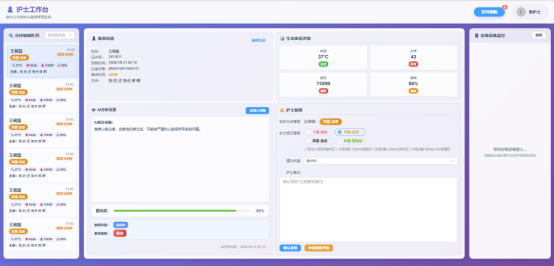
 
Cloud Screenshot
</td>
<td align="center">
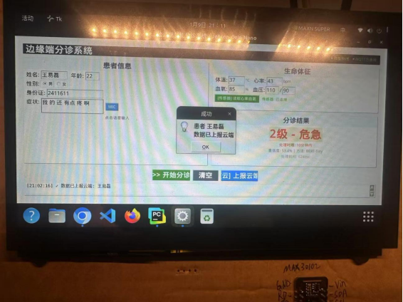
 
Edge Screenshot
</td>
</tr>
</table>

## **[AI Large Model Multi-Platform Automated Collection System](https://github.com/yileidev/craw-platform)**

*Development Period: August 2025 - June 2026 (Team Development)*

Project Introduction: Craw Platform is a multi-model crawler task scheduling and execution platform built on FastAPI, MySQL, and Redis. It reads business tasks from the database, splits them into execution units by model, question, and round, and distributes them to model queues such as Ant Alipay, Doubao, DeepSeek, and Yuanbao. Consumers execute the crawlers and write back results, while supporting account allocation, priority scheduling, failure retry, health checks, heartbeat monitoring, and alert management.

**Tech Stack:** Python + FastAPI + MySQL + Redis + Playwright/Selenium crawlers + Docker

## 📚 Education Background

### **Shanghai Jian Qiao University** | Bachelor's Degree in Computer Science and Technology
*Graduation Date: June 2026*

**Major Courses:**
- Data Structures, Database Principles, Introduction to Artificial Intelligence, Computer Networks, Operating Systems, Computer Organization
- Microcontroller Application Technology, Object-Oriented Programming, Introduction to Software Engineering, JavaWeb Development Technology

**Academic Performance:**
- GPA **3.76/4**, ranking **top 1%** of major
- [Shanghai Outstanding Graduate](https://xxjs.gench.edu.cn/2026/0331/c3711a178576/page.htm)
- Multiple university-level scholarships and outstanding student honors

<table>
<tr>
<td align="center">
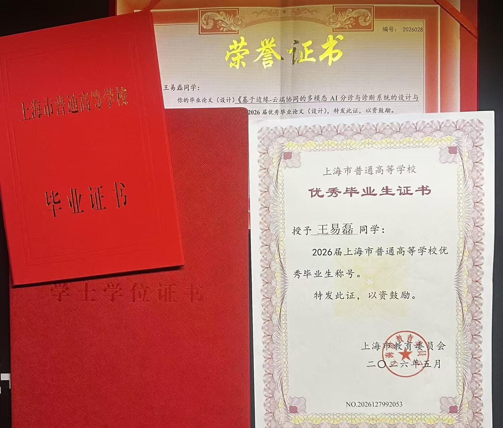
 
</td>
</tr>
</table>

**Professional Certificates:**
- Shanghai Computer Level 2 (Internet of Things Technology and Applications)
- Shanghai Computer Level 3 (Computer Network Technology and Applications)
- National Computer Level 1 Certificate (Computer Fundamentals and MS Office Applications)

<table>
<tr>
<td align="center">
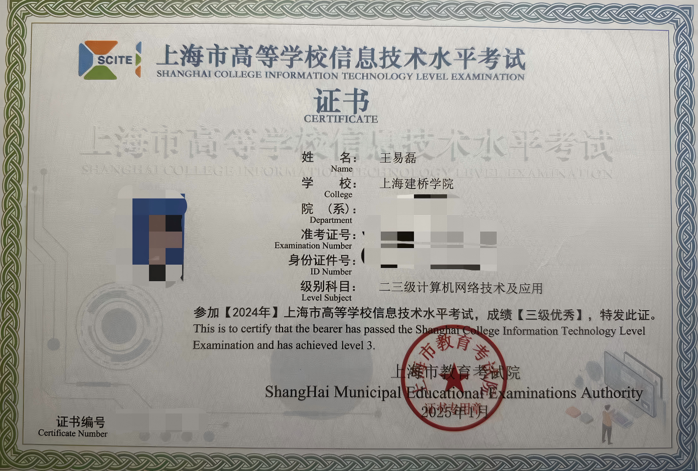
 
Computer Network Technology
 
</td>
<td align="center">
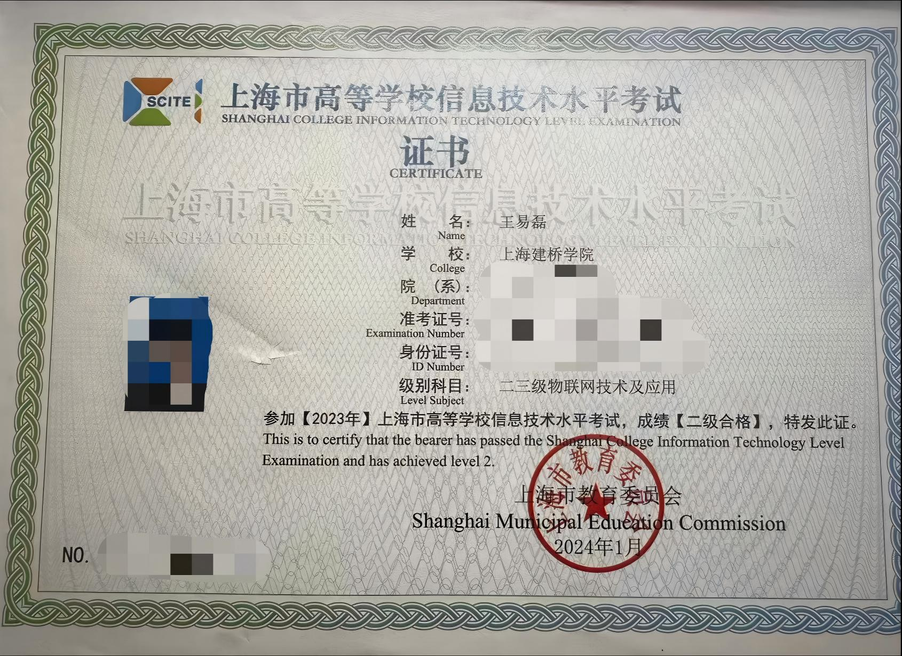
 
IoT Technology and Applications
</td>
<td align="center">

 
Computer Fundamentals and MS Office
</td>
</tr>
</table>

### **Honors and Competitions**
- 🏆 [2nd "SSE Cup" Shanghai College Students Innovation and Entrepreneurship Competition (New Generation Information Technology Track) **Municipal Second Prize**](https://ieeic.ecnu.edu.cn/70/69/c4170a684137/page.htm)

<table>
<tr>
<td align="center">
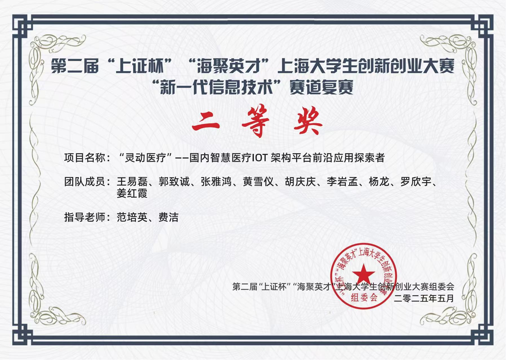
 
2nd "SSE Cup" Shanghai College Students Innovation and Entrepreneurship Competition Municipal Second Prize
 
</td>
</tr>
</table>

  **Project Name**: "Smart Medical" - Pioneer in Domestic Smart Medical IoT Architecture Platform Applications  

  **Project Positioning**: Targeting the core pain points of closed information system architecture, serious data silos, and foreign systems' "poor adaptation" in domestic medical institutions, Smart Medical has created a smart medical IoT architecture platform based on domestic software and hardware ecosystems, achieving full-stack domestic replacement and interoperability of core systems such as HIS, EMR, and PACS.
  
  **My Role and Contributions**:
  - **Role**: Project Leader
  - **Core Work**: Served as project leader, comprehensively coordinating the entire project process from planning, preparation to competition. Led project plan formulation, reasonably allocated team member work tasks and provided guidance, supervised execution progress, and coordinated resolution of internal team issues. Led project outcome summary and presentation work, including business plan writing, roadshow PPT and promotional video production, and organized team speech rehearsals to ensure professional, logically clear presentation content that effectively communicated project value.

- 🏆 [China International "Internet+" College Students Innovation and Entrepreneurship Competition **Municipal Silver Award**](https://edu.sh.gov.cn/web/detail_gsgg/d8d9d610-f3f1-4599-b7b7-d93d7d403190)

<table>
<tr>
<td align="center">
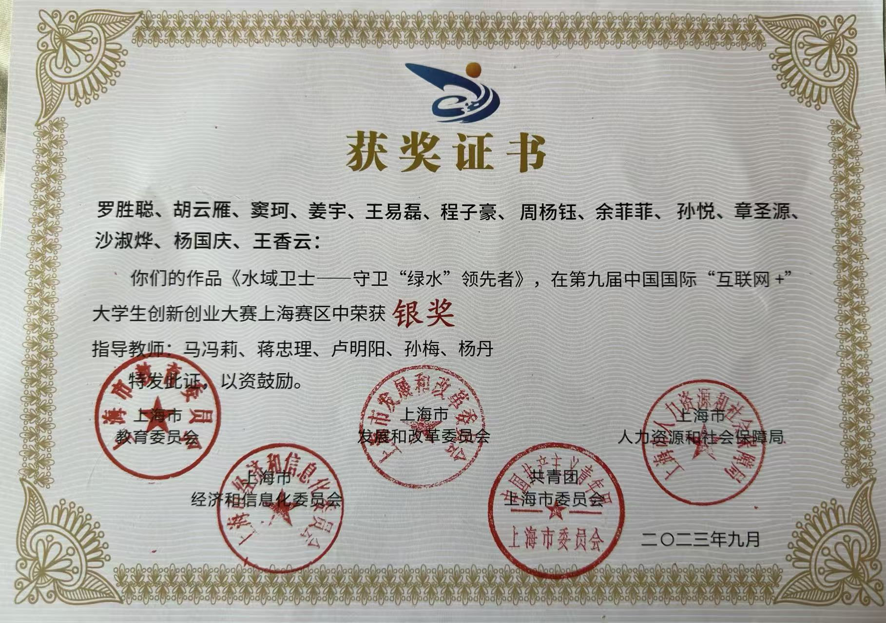
</td>
<td align="center">
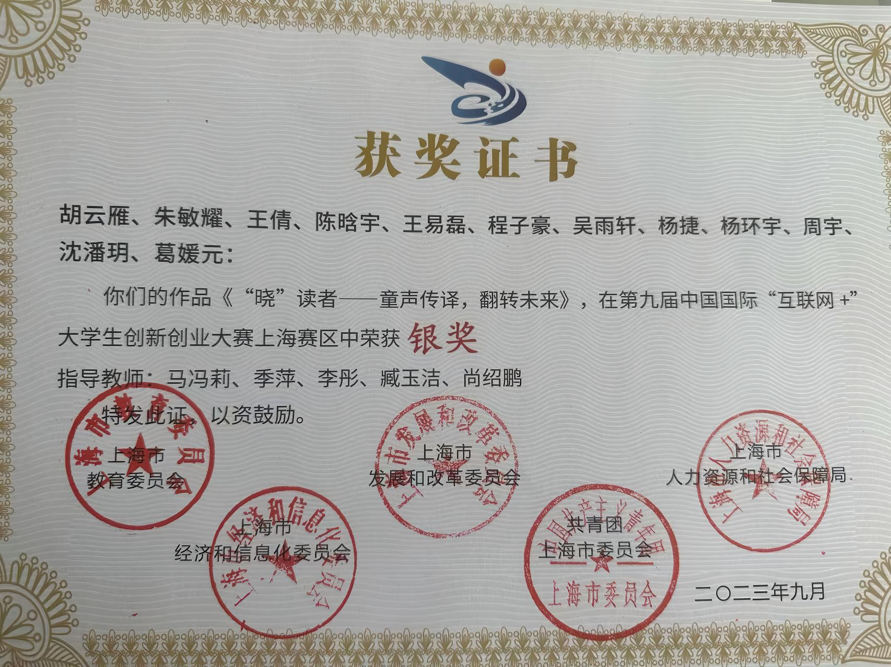
 
</td>
</tr>
</table>

  **My Role and Contributions**:
  - **Role**: Project Member
  - **Core Work**: Utilized Pr and Ae technology to create roadshow PPT promotional videos and partial business plan writing.

- 🏆 [National College Students Career Planning Competition Higher Education Main Track **Municipal Excellence Award**](https://edu.sh.gov.cn/xxgk2_zdgz_xxxsgz_04/20250821/76d38fdb813f4274adae0fc072c09902.html)

<table>
<tr>
<td align="center">
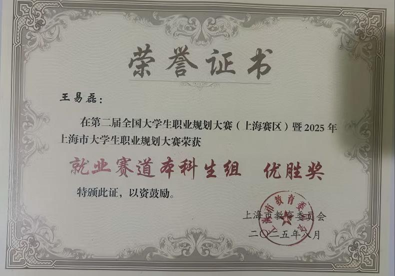
</td>
</tr>
</table>

- 🏅 [University Outstanding Thesis](https://www.gench.edu.cn/jwc1/2026/0617/c12757a184319/page.htm)

<table>
<tr>
<td align="center">
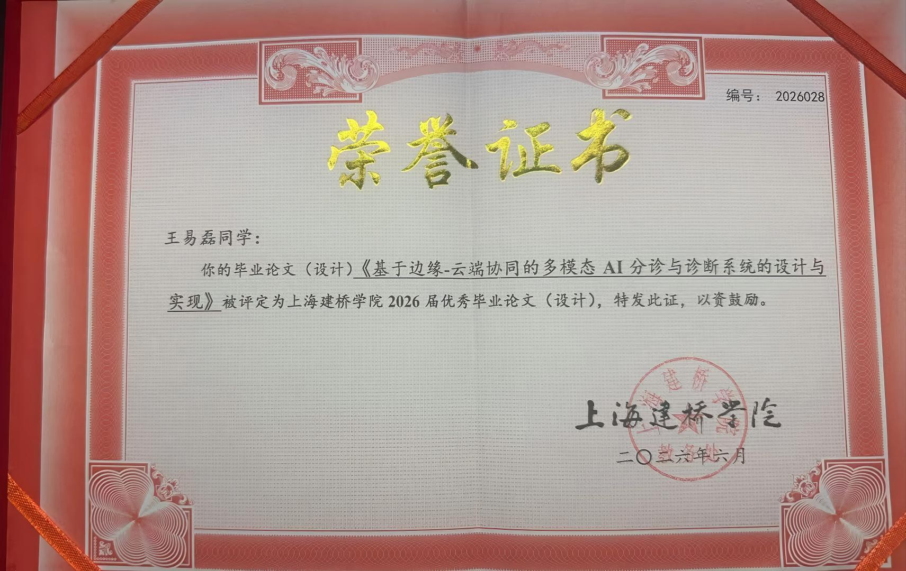
</td>
</tr>
</table>

### **Campus Leadership**
- **Student Apartment Building Manager**: Coordinated management of 300+ person scale dormitory building, awarded outstanding building manager

<table>
<tr>
<td align="center">
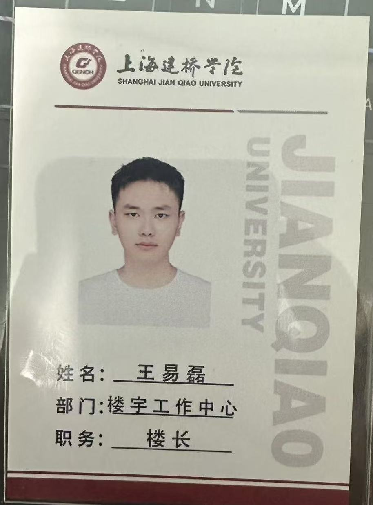
</td>
</tr>
</table>

- **Club Publicity Minister**: Independently operated club official WeChat account, led content layout and event promotion material production

### **Language Proficiency**
- College English Test Band 4 (CET-4)

<table>
<tr>
<td align="center">
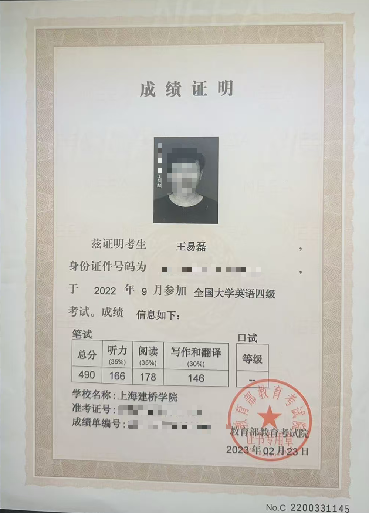
</td>
</tr>
</table>

- Mandarin Level 2 Grade A

## 🎯 Interests and Hobbies

### **Technology and Learning**
- Exploring LLM application development and RAG retrieval-augmented generation technology
- Building personal projects and experimenting with new technologies
- Following AI industry trends and Prompt Engineering

### **Creative Pursuits**
- Professional photography and photo editing
- Video editing and special effects production
- Writing technical blog articles and tutorials

### **Outdoor Activities**
- Hiking and nature photography
- Cycling and exploring new routes
- Traveling and experiencing different cultures

### **Other Interests**
- Reading science fiction and fantasy novels
- Cooking and trying new recipes

## 📊 GitHub Stats

## 📫 Contact Me

---

⭐ **Welcome to explore my repositories, feel free to contact me for collaboration opportunities!** ⭐

*Last Updated: August 2026*
