# 👋 你好，我是王易磊 | 个人开发者

## 🚀 关于我

我是一名充满创造力的软件开发者，专注于从用户角度出发创造可改变生活的应用。2026届应届毕业生，专业前1%，上海市优秀毕业生。具备Python全栈开发与LLM应用落地能力，善于跨环节协同与问题排查，自驱务实。

- 🌱 **正在学习：** 高级全栈技术与多智能体协同
- 👯 **希望合作：** 开源项目，特别是AI应用与RAG相关技术
- 💬 **可以问我：** Python、LLM应用开发、网络爬虫、Prompt Engineering
- 📫 **如何联系我：** [yilei.dev@gmail.com](mailto:yilei.dev@gmail.com) | [yilei.dev@outlook.com](mailto:yilei.dev@outlook.com)
- 📄 **下载简历：** [点击下载我的简历](./王易磊简历.pdf) 📥

## 🛠️ 技术栈

## 🎨 精选项目

## **[基于边缘-云端协同的多模态AI分诊与诊断系统的设计与实现 | 毕业设计](https://github.com/yileidev/smart-med-ai-platform)**
*开发时间：2025.09-2026.03（独立开发）*

项目介绍：该项目是一个面向急诊医疗场景的端云协同智能分诊系统，集成了 AI 辅助诊断、规则引擎、边缘设备采集、实时通信、多角色协同管理和医疗资源调度 等能力。项目通过 Spring Boot 后端、Vue 3 前端和 Python 边缘端共同构建，旨在提升急诊分诊效率、规范诊疗流程、降低医护人员重复录入负担，并为急诊科室提供智能化、可追溯、可扩展的分诊管理方案。

该平台以急诊分诊业务为核心，覆盖患者到院登记、生命体征采集、边缘端预分诊、云端 AI 辅助分析、Drools 规则判断、护士复核确认、医生接诊诊断、医疗资源调度、系统监控与日志审计等完整流程，形成从“数据采集”到“诊疗决策辅助”的闭环。

**技术栈：** Java + Spring Boot + Vue 3 + MySQL + Redis + LangChain4j + Drools + MQTT + WebSocket + Python + Docker + vibecoding（Claude code）

<table>
<tr>
<td align="center">
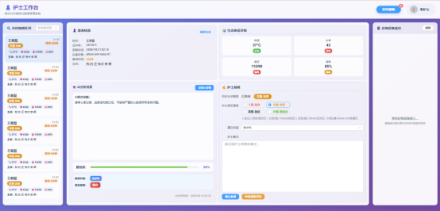
 
云端截图
</td>
<td align="center">
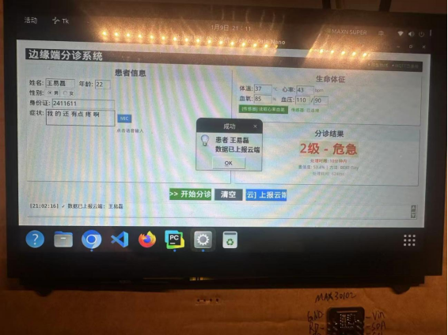
 
边缘端截图
</td>
</tr>
</table>

## **[AI大模型多平台自动化采集系统](https://github.com/yileidev/craw-platform)**

*开发时间：2025.08-2026.06（团队开发）*

项目介绍：Craw Platform 是一个基于 FastAPI、MySQL 和 Redis 构建的多模型爬虫任务调度与执行平台，可从数据库读取业务任务，按模型、问题和轮次拆分为执行单元，分发到 蚂蚁阿福、豆包、DeepSeek、元宝 等模型队列，由消费者执行爬虫并回写结果，同时支持账号分配、优先级调度、失败重试、健康检查、心跳监控和告警管理。

**技术栈：** Python + FastAPI + MySQL + Redis + Playwright/Selenium 爬虫 + Docker

## 📚 教育背景

### **上海建桥学院** | 计算机科学与技术学士学位
*毕业时间：2026年6月*

**主修课程：**
- 数据结构、数据库原理、人工智能导论、计算机网络、操作系统、计算机组成原理
- 单片机应用技术、面向对象程序设计、软件工程导论、JavaWeb开发技术

**学业表现：**
- 学业绩点 **3.76/4**，位列专业 **前1%**
- [上海市优秀毕业生](https://xxjs.gench.edu.cn/2026/0331/c3711a178576/page.htm)
- 多次荣获校级奖学金及优秀学生称号

<table>
<tr>
<td align="center">
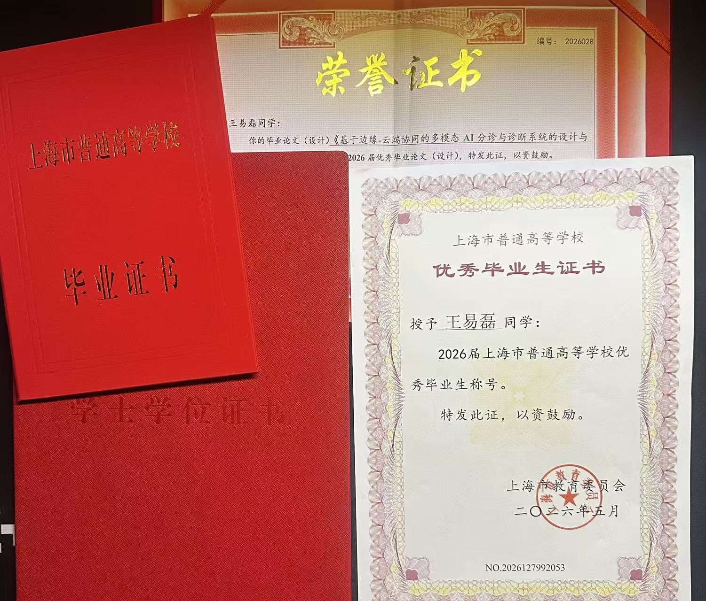
 
</td>
</tr>
</table>

**专业证书：**
- 上海市计算机二级（物联网技术及应用）
- 上海市计算机三级（计算机网络技术及应用）
- 全国计算机一级证书（计算机基础及MS Office应用）

<table>
<tr>
<td align="center">
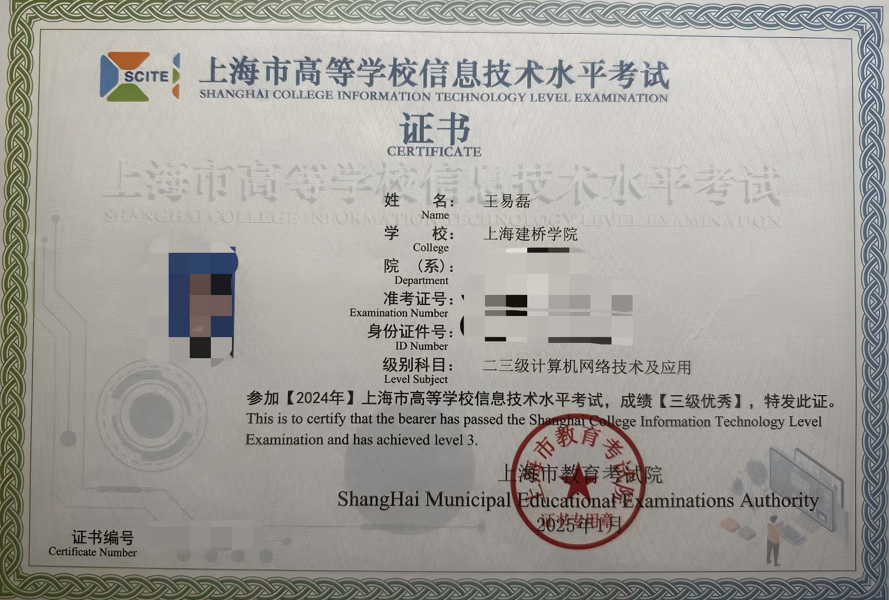
 
计算机网络技术
 
</td>
<td align="center">
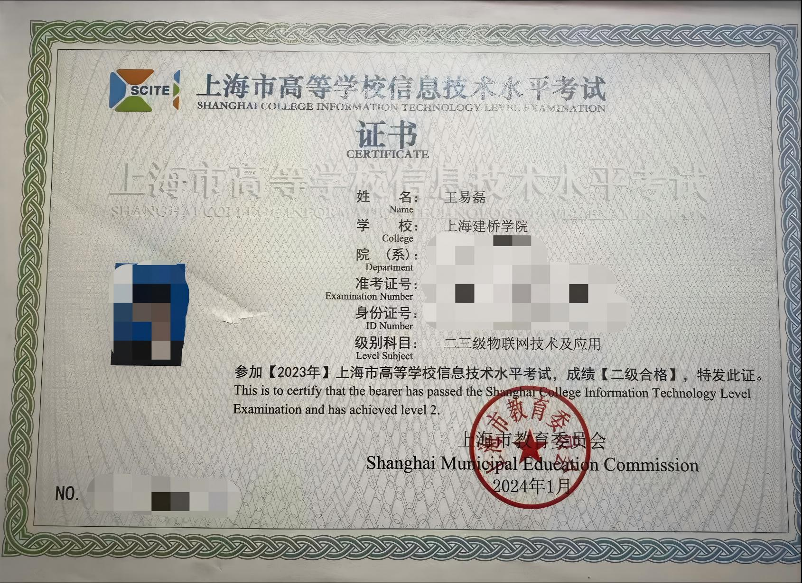
 
物联网技术及应用
</td>
<td align="center">

 
计算机基础及MS Office应用
</td>
</tr>
</table>

### **荣誉与竞赛**
- 🏆 [第二届"上证杯"上海大学生创新创业大赛（新一代信息技术赛道）**市赛二等奖**](https://ieeic.ecnu.edu.cn/70/69/c4170a684137/page.htm)

<table>
<tr>
<td align="center">
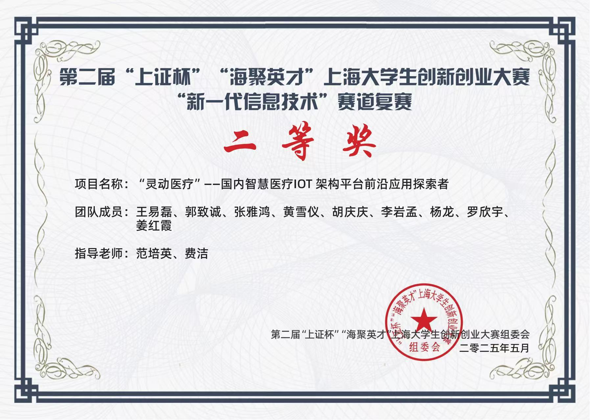
 
 第二届"上证杯"上海大学生创新创业大赛（新一代信息技术赛道）市赛二等奖
 
</td>
</tr>
</table>

  **项目名称**：“灵动医疗”——国内智慧医疗IoT架构平台前沿应用探索者  

  **项目定位**：针对国内医疗机构信息化系统架构封闭、数据孤岛严重、国外系统“水土不服” 的核心痛点，灵动医疗打造了一款基于国产化软硬件生态的智慧医疗IOT架构平台，实现HIS、EMR、PACS等核心系统全栈国产化替代与医疗数据的互联互通互认。
  
  **我的角色与贡献**：
  - **角色**：项目负责人
    - **核心工作**： 担任项目负责人，全面统筹项目从策划、筹备到参赛的全流程管理，主导项目计划制定，合理分配团队成员工作任务并提供指导，监督执行进度，协调解决团队内部问题。主导项目成果的总结与展示工作，包括商业计划书撰写、路演PPT及宣传视频制作，并组织团队进行演讲演练，确保展示内容专业、逻辑清晰，有效传达项目价值。

- 🏆 [中国国际"互联网+"大学生创新创业大赛 **市赛银奖**](https://edu.sh.gov.cn/web/detail_gsgg/d8d9d610-f3f1-4599-b7b7-d93d7d403190)

<table>
<tr>
<td align="center">
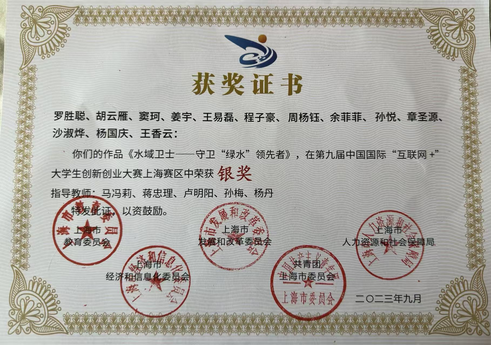
</td>
<td align="center">
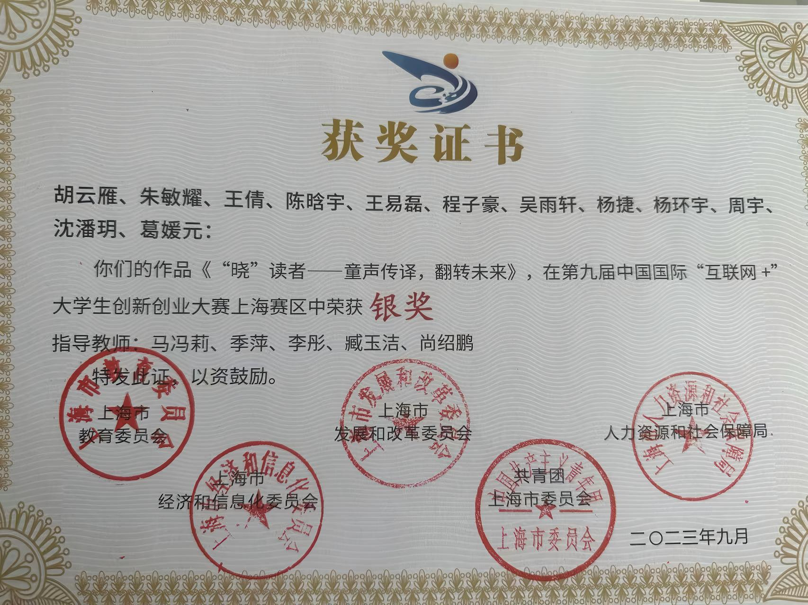
 
</td>
</tr>
</table>

  **我的角色与贡献**：
  - **角色**：项目成员
  - **核心工作**：利用Pr、Ae技术制作路演PPT宣传视频和部分商业计划书的撰写。

- 🏆 [全国大学生职业规划大赛高教主赛道 **市赛优胜奖**](https://edu.sh.gov.cn/xxgk2_zdgz_xxxsgz_04/20250821/76d38fdb813f4274adae0fc072c09902.html)

<table>
<tr>
<td align="center">
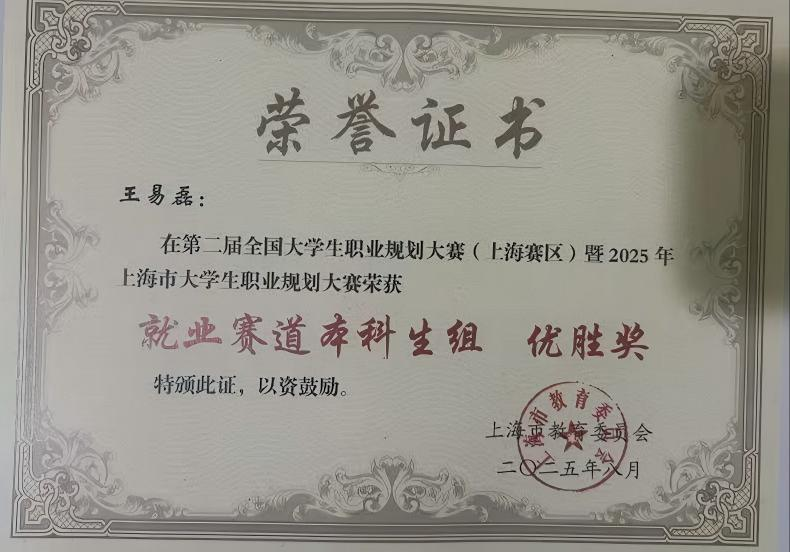
</td>
</tr>
</table>

- 🏅 [校优秀毕业论文](https://www.gench.edu.cn/jwc1/2026/0617/c12757a184319/page.htm)

<table>
<tr>
<td align="center">
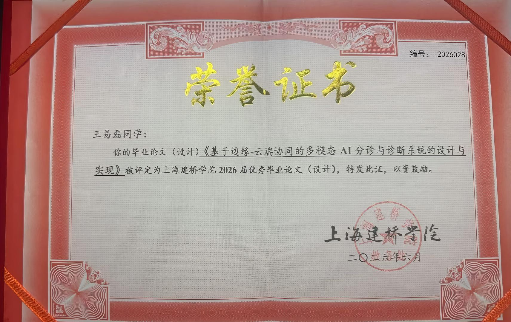
</td>
</tr>
</table>

### **校园领导力**
- **学生公寓楼长**：统筹管理300+人规模楼栋，获评校级优秀楼长

<table>
<tr>
<td align="center">
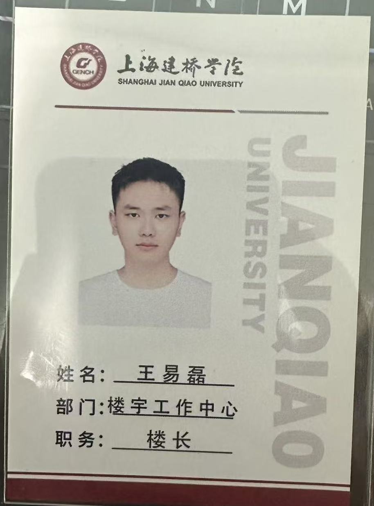
</td>
</tr>
</table>

- **社团宣传部长**：独立运营社团官方公众号，主导内容排版与活动宣传物料制作

### **语言能力**
- 大学英语四级（CET-4）

<table>
<tr>
<td align="center">
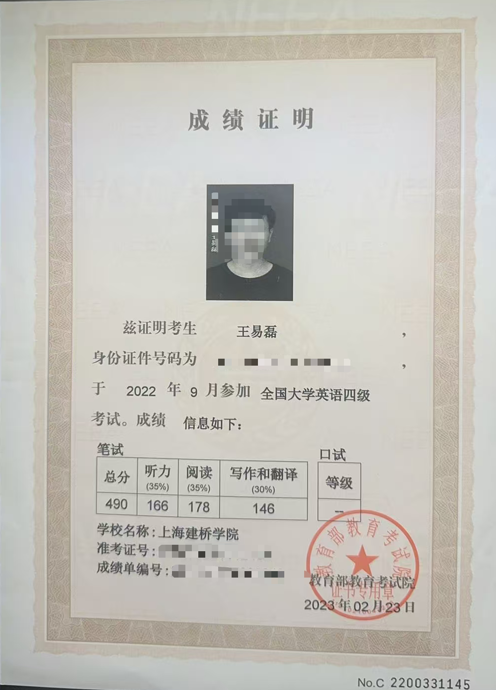
</td>
</tr>
</table>

- 普通话二级甲等

## 🎯 兴趣爱好

### **技术与学习**
- 探索LLM应用开发与RAG检索增强生成技术
- 构建个人项目并尝试新技术
- 关注AI行业趋势与Prompt Engineering

### **创意追求**
- 专业摄影和照片编辑
- 视频剪辑与特效制作
- 撰写技术博客文章和教程

### **户外活动**
- 徒步旅行和自然摄影
- 骑行和探索新路线
- 旅行和体验不同文化

### **其他兴趣**
- 阅读科幻和奇幻小说
- 烹饪和尝试新食谱

## 📊 GitHub 统计

## 📫 联系我

---

⭐ **欢迎探索我的仓库，如有合作意向请随时联系！** ⭐

*最后更新：2026年8月*
